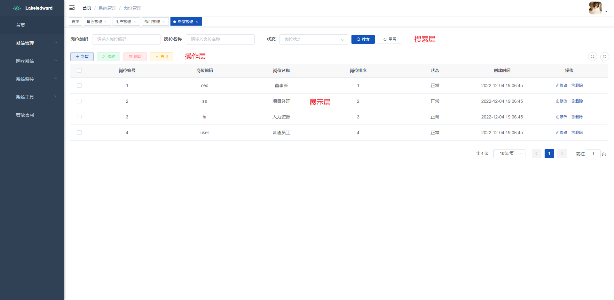

# 快速上手

### 说明

页面一般分为三层，最上层的搜索层，中间的操作层，下层的展示层，分别对应为:

- 搜索层-searchLayer
- 操作层-operateLayer
- 展示层-displayLayer



在每层对象中设置每层需要展示的内容以及需要的功能。

### 使用示例

选配字典项时，`onDictReady`方法为必写项；

```vue
<template>
  <ry-layer-page
    ref="layerPage"
    :search-layer="searchLayer"
    :operate-layer="operateLayer"
    :display-layer="displayLayer"
    :loading="false"
  />
</template>
<script>
export default {
 dicts: ["sys_normal_disable", "sys_show_hide"],
 data() {
   searchLayer:{},
   operateLayer:{},
   displayLayer:{}
 },
 methods: {
    // 字典加载完成的回调
    onDictReady(dict) {
      // 初始化字典项
      this.$refs.layerPage.initDicts(dict);
    },
  },
}
</script>
```

### 属性

| 属性           | 说明                                    | 类型    | 可选值 | 默认值 |
| :------------- | :-------------------------------------- | :------ | :----- | :----- |
| ref            | 组件Ref                                 | string  | —      | —      |
| search-layer   | 页面顶部的查询条件                      | object  | —      | —      |
| operate-layer  | 页面需要的操作按钮项                    | object  | —      | —      |
| display-layer  | 页面的表格数据                          | object  | —      | —      |
| loading        | 是否需要加载表格图标                    | boolean | —      | true   |
| right-toolbar  | 是否需要展示收缩查询条件、刷新等Toolbar | boolean | —      | true   |
| clearSelection | 弹框关闭，是否自动清除表格的选中状态    | boolean | —      | true   |

<style>
table th:first-of-type {
    width: 20%;
}
table th:nth-of-type(2) {
    width: 30%;
}
table th:nth-of-type(3) {
    width: 15%;
}
</style>
